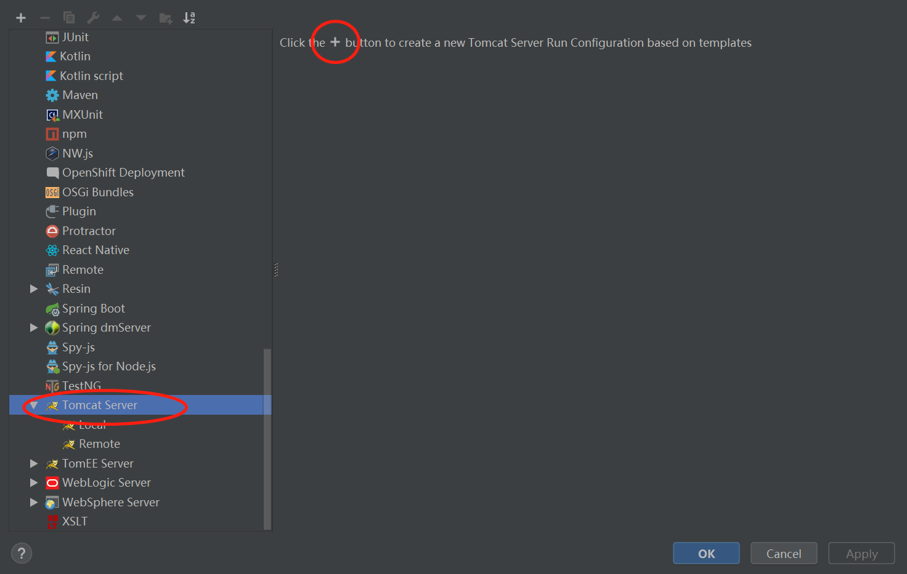

我于是2009年进入IT这个行业，从学习Java语言开始，然后学习了Servlet,JSP,JavaBean技术，在那个时候很多项目都是用Servlet、JSP、JavaBean做的，进款那时候各种框架已经存在了，后来学习了Spring、Struts2，Hibernate等框架。当SpringMVC之后，用的人越来越多。但是它的基础其实还是Servlet，深入学习Servlet对web开发非常重要，所以本次我将Servlet的知识点梳理一下，深入的把servlet原理以及tomcat的原理做一个总结。

下面就让我们开始吧!
# Servlet-Hello

## 创建项目
* 首先新建一个空的Maven项目Servlet-Demo，具体的子项目全部以Module形式存在

* 新建Module,右键项目—New—Module—Maven—maven-archetype-webapp,点击Nest


* 输入arrifactId，点击Next


* 输入Module name,点击Next


* File—Project Structure—Modules,选择Servlet-Hello这个Module，在main目录下新建java目录,并标记为source


* 继续在main目录下新建resources目录，标记为resources


* 然后点击OK，项目就建好了，类似于下面这样：


* 编写Servlet程序需要用到Servlet api,将依赖的jar包通过Maven方式配置

```xml

<dependencies>
    <dependency>
        <groupId>javax.servlet</groupId>
        <artifactId>javax.servlet-api</artifactId>
        <version>3.0.1</version>
        <scope>provided</scope>
    </dependency>
</dependencies>
```

* 创建HelloWorldServlet，继承HttpServlet类并实现doGet方法
```java

public class HelloWorldServlet extends HttpServlet {

    protected void doGet(HttpServletRequest request, HttpServletResponse response)
            throws IOException {
        response.setContentType("text/html");
        PrintWriter out = response.getWriter();
        out.write("<h1>" + "Hello Servlet" + "</h1>");
    }
}
```

* xml配置内容如下
```xml

<web-app>
  <display-name>Archetype Created Web Application</display-name>

  <servlet>
    <servlet-name>HelloWorldServlet</servlet-name>
    <servlet-class>com.demo.servlet.HelloWorldServlet</servlet-class>
  </servlet>
  <servlet-mapping>
    <servlet-name>HelloWorldServlet</servlet-name>
    <url-pattern>/HelloWorldServlet</url-pattern>
  </servlet-mapping>
</web-app>
```
好了，完成以上的步骤开发工作就完成了，要想运行起来需要配置一下Web服务器，本文使用tomcat


* 配置tomcat
IntelliJ IDEA 配置tomcat:Run—Edit Configurations 选中tomcat 点击左上角+


* tomcat配置成功之后将项目部署到tomcat中，在浏览器中输入如下路径，如果""HelloWorld字样则说明成功"

```text
http://localhost:8080/hello/
```

好了，大功告成，今天就到这里吧，背单词去。

# InitMethod

创建InitMethodServlet，并编写init方法和doGet方法

```java
public class InitMethodServlet extends HttpServlet {

    @Override
    public void init() throws ServletException {
        System.out.println("init method.......");
    }

    public void doGet(HttpServletRequest request, HttpServletResponse response) throws ServletException, IOException {

    }
}
```

在xml中配置InitMethodServlet
```xml
<servlet>
    <servlet-name>InitMethodServlet</servlet-name>
    <servlet-class>com.anthony.servlet.demo.InitMethodServlet</servlet-class>
  </servlet>
  <servlet-mapping>
    <servlet-name>InitMethodServlet</servlet-name>
    <url-pattern>/InitMethodServlet</url-pattern>
  </servlet-mapping>
```

根据以上配置，我们直接启动tomcat，发现servlet并没有被实例化，也就是说控制台上没有打印出"init method......."。
如果想让tomcat启动时实例化该servlet，可以通过load-on-startup标签实现。

```xml
<servlet>
    <servlet-name>InitMethodServlet</servlet-name>
    <servlet-class>com.anthony.servlet.demo.InitMethodServlet</servlet-class>
    <load-on-startup>1</load-on-startup>
  </servlet>
  <servlet-mapping>
    <servlet-name>InitMethodServlet</servlet-name>
    <url-pattern>/InitMethodServlet</url-pattern>
  </servlet-mapping>
```


