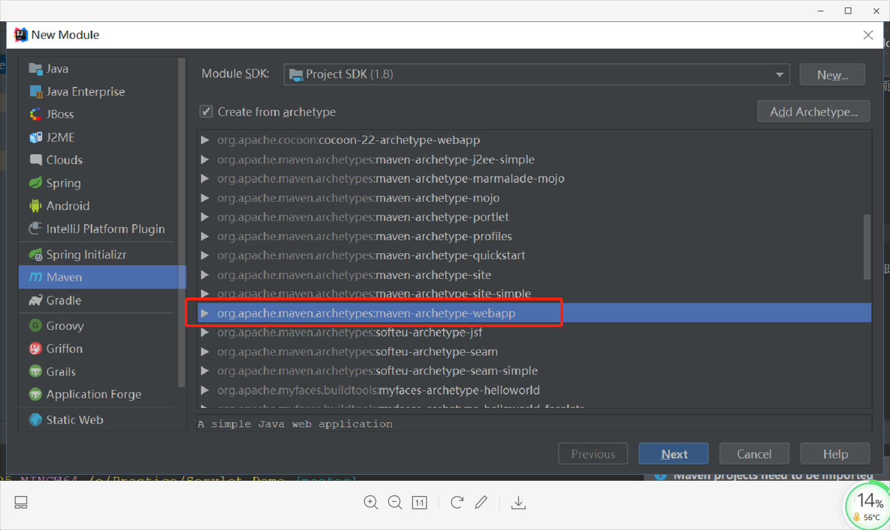
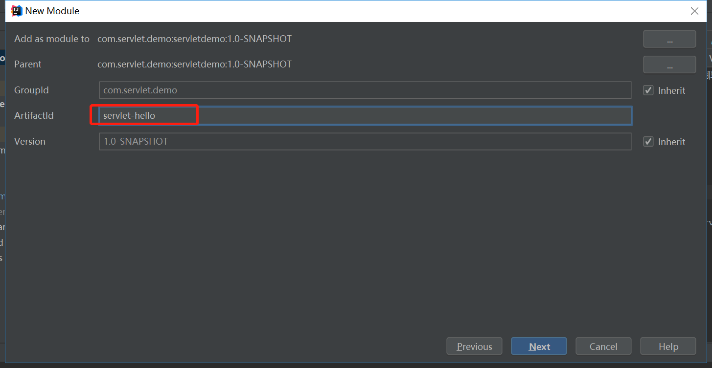
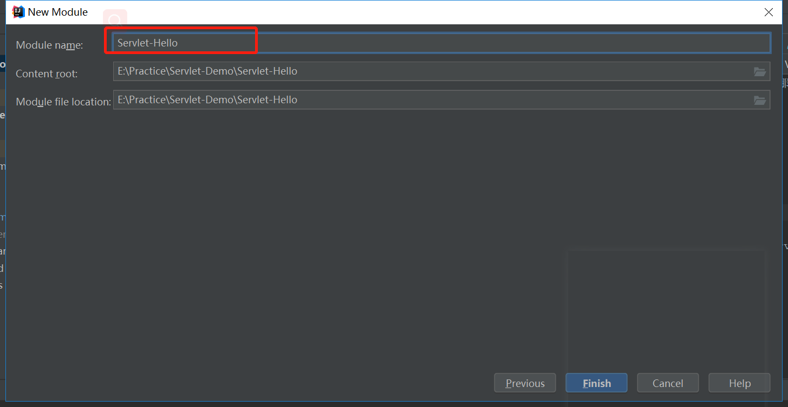
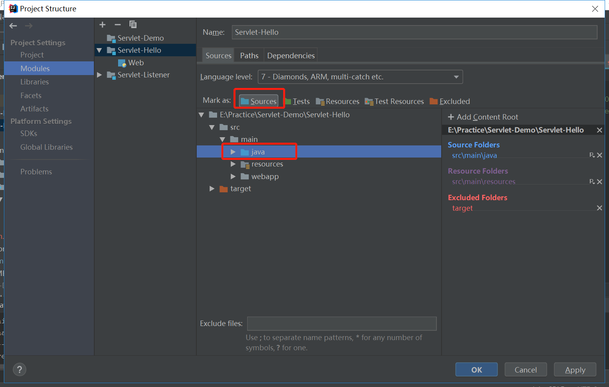
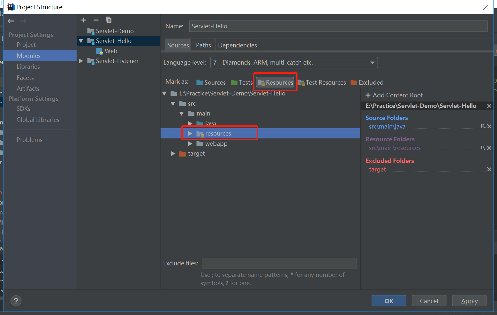
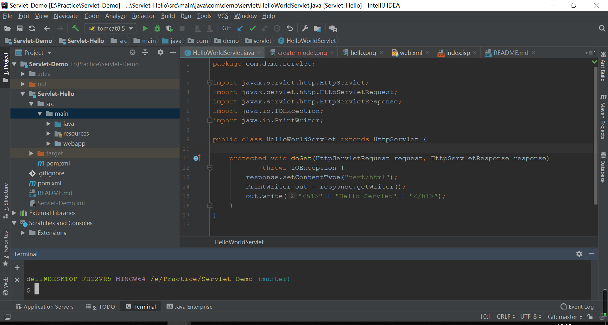

我于是2009年进入IT这个行业，从学习Java语言开始，然后学习了Servlet,JSP,JavaBean技术，在那个时候很多项目都是用Servlet、JSP、JavaBean做的，进款那时候各种框架已经存在了，后来学习了Spring、Struts2，Hibernate等框架。当SpringMVC之后，用的人越来越多。但是它的基础其实还是Servlet，深入学习Servlet对web开发非常重要，所以本次我将Servlet的知识点梳理一下，深入的把servlet原理以及tomcat的原理做一个总结。

下面就让我们开始吧!
# Servlet-Hello

## 创建项目
* 首先新建一个空的Maven项目Servlet-Demo，具体的子项目全部以Module形式存在

* 新建Module,右键项目—New—Module—Java—Web Application

* 添加servlet-api，右键Module—Open Module Settings—Libraries—Java，选择本地Servlet jar包即可

* IntelliJ IDEA 配置tomcat:Run—Edit Configurations 选中tomcat 点击左上角+







## 源码
```java

public class HelloWorldServlet extends HttpServlet {

    protected void doGet(HttpServletRequest request, HttpServletResponse response)
            throws IOException {
        response.setContentType("text/html");
        PrintWriter out = response.getWriter();
        out.write("<h1>" + "Hello Servlet" + "</h1>");
    }
}
```

xml配置内容如下：
```xml

<web-app>
  <display-name>Archetype Created Web Application</display-name>

  <servlet>
    <servlet-name>HelloWorldServlet</servlet-name>
    <servlet-class>com.demo.servlet.HelloWorldServlet</servlet-class>
  </servlet>
  <servlet-mapping>
    <servlet-name>HelloWorldServlet</servlet-name>
    <url-pattern>/HelloWorldServlet</url-pattern>
  </servlet-mapping>
</web-app>
```

## 验证方法
在浏览器中输入如下路径，如果""HelloWorld字样则说明成功"
```text
http://localhost:8080/hello/
```
